<!-- NeuralForge-X — README -->
<p align="center">
  
</p>

<h1 align="center">NeuralForge-X</h1>

<p align="center">
  <strong>High-Performance AI Infrastructure Platform</strong><br>
  Vector Search · GPU Acceleration · Retrieval Systems · Benchmarking · Production AI Engineering
</p>

<p align="center">
  
  
  
  
  
  
</p>
<p align="center">
  
  
  
  
  
  
</p>

<p align="center">
  🚀 <strong>GPU Accelerated</strong> &nbsp;·&nbsp;
  ⚡ <strong>SIMD Optimized</strong> &nbsp;·&nbsp;
  🧠 <strong>AI Infrastructure</strong> &nbsp;·&nbsp;
  📈 <strong>Benchmark Driven</strong> &nbsp;·&nbsp;
  🔥 <strong>Production Ready</strong>
</p>

> [!IMPORTANT]
> **Hardware & environment.** The **GPU engine** requires an **NVIDIA Blackwell
> GPU (`sm_120`, e.g. RTX 5090)** with a **CUDA 12.8+ driver** and **PyTorch
> (cu128)**. **CPU-only
> mode is fully functional on any platform** — the SIMD core, Python SDK, HNSW
> vector DB, benchmark/profiling labs, and the axum service all run without a GPU.

---

## Table of contents

> **Reviewers & recruiters:** jump to
> [Engineering competencies demonstrated](#engineering-competencies-demonstrated)
> for a module-by-module map of the skills this project exercises.

- [Overview](#overview) · [Why](#why-neuralforge-x) · [Architecture](#architecture) · [How a search flows](#how-a-search-flows) · [Features](#features)
- [Technology stack](#technology-stack) · [Algorithms](#algorithms) · [Performance](#performance) · [GPU engine](#gpu-engine)
- [Install](#installation) · [Quickstart](#quickstart) · [Benchmarks](#benchmarks)
- [Profiling](#profiling) · [Observability](#observability) · [Scaling](#scaling)
- [Documentation](#documentation) · [Roadmap](#roadmap) · [Contributing](#contributing)
- [Engineering competencies demonstrated](#engineering-competencies-demonstrated)

---

## Overview

**NeuralForge-X** is a from-scratch, fully-local AI-infrastructure platform for
high-throughput **dense vector search and retrieval**. The compute core is
written in **Rust** — hand-vectorised **AVX2 + FMA** kernels parallelised with
**rayon** — and exposed to **Python** through zero-copy **PyO3 / maturin**
bindings. A dedicated **CUDA + Triton** engine targets the local **RTX 5090
(Blackwell, `sm_120`)** GPU; a hand-written **HNSW** vector database adds
sub-linear retrieval; and an **axum** service makes the whole thing observable
with Prometheus, OpenTelemetry, and Grafana.

It is engineered to feel like production infrastructure — typed errors, property
tests, CI gates, reproducible benchmarks, generated charts, and a full design-doc
site — **not** a tutorial or a demo.

| Headline result | Number | Workload |
|-----------------|:------:|----------|
| **5-NN cosine search** | **3.4 ms** | 100,000 × 768-dim corpus (exact, Rust SIMD) |
| **HNSW vs exact scan** | **28× faster** | top-10 ANN at recall 1.0 (~0.06 ms) |
| **GPU batch cosine** | **up to 7.4×** | vs multi-core Rust CPU (RTX 5090, `sm_120`) |

All numbers are reproducible — see [Benchmarks](#benchmarks) and [Performance](#performance).

<p align="center">
  
</p>

<p align="center"><sub><em>Illustrative animated demo — see the <a href="#benchmarks">benchmarks</a> section for reproducible results and real output.</em></sub></p>

> **Status: all nine phases complete.** Rust core, PyO3 SDK, the CUDA + Triton
> GPU engine (validated on an RTX 5090 Blackwell GPU), the HNSW vector DB, the
> cross-stack benchmark lab, the CPU/GPU profiling lab, the observability service,
> and the MkDocs documentation site are all built, tested, and benchmarked. See
> the [roadmap](#roadmap).

## Why NeuralForge-X

| Concern | Approach |
|---------|----------|
| **Latency** | SIMD inner-product/distance kernels with 4-way FMA accumulation; GIL released around compute. |
| **Throughput** | rayon data-parallel batch similarity; parallel bounded-heap top-k (`O(n·d + n·log k)`). |
| **Memory** | Contiguous row-major `f32` corpora; zero-copy NumPy interop; `O(k·threads)` retrieval memory. |
| **Correctness** | `proptest`/`hypothesis` parity vs scalar & NumPy references; typed error model across the FFI. |
| **Scale** | Hand-written HNSW for sub-linear ANN; GPU offload when the workload is compute-bound. |
| **Operability** | axum service with Prometheus `/metrics`, OpenTelemetry traces, `/healthz` · `/readyz`. |

## Architecture

NeuralForge-X follows a **hexagonal / ports-and-adapters** layout: a pure compute
*domain core* with thin adapters at the edges — the Python SDK, the GPU
accelerator, the HNSW persistence layer, and the HTTP service all depend *inward*
on the core, never the reverse.

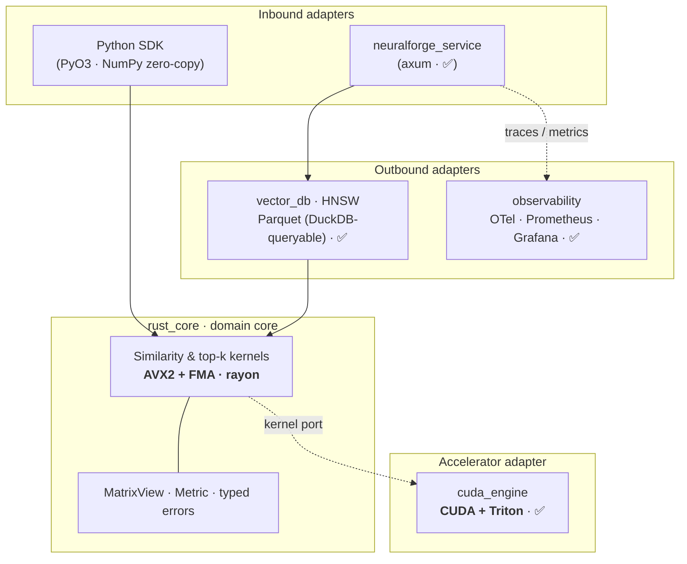

<p align="center">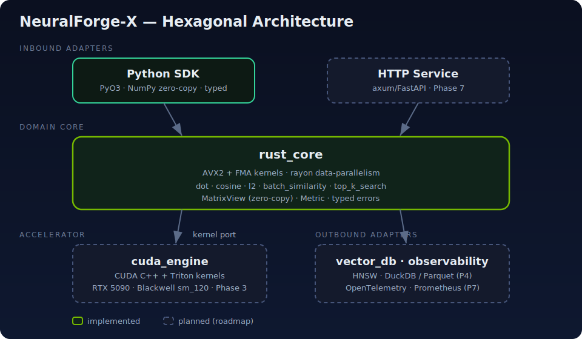</p>

See [Architecture](docs/ARCHITECTURE.md) and [System Design](docs/SYSTEM_DESIGN.md) for the full design.

## How a search flows

A query streams through SIMD distance kernels, fans out across `rayon` workers
that each keep a private size-`k` heap, and the heaps merge into a best-first
result list — never materialising the full score array.

<p align="center"></p>

## Features

- ⚡ **SIMD kernels** — AVX2 + FMA `dot_product`, `cosine_similarity`,
  `l2_distance` with runtime feature detection and a portable scalar fallback.
- 🧮 **Batched similarity** — full `queries × corpus` matrix, rayon-parallel,
  with corpus norms precomputed once for cosine.
- 🔎 **Top-k retrieval** — parallel bounded min-heap selection; cosine, dot, L2.
- 🐍 **Typed Python SDK** — `py.typed`, `.pyi` stubs, validated inputs, a
  `SearchResult` type, and a `NeuralForgeError` hierarchy.
- 🖥️ **GPU engine** — hand-written CUDA C++ **and** Triton kernels (plus a
  PyTorch baseline), compiled natively for Blackwell `sm_120`; **up to 7.4×** over
  the multi-core CPU path on batched similarity.
- 🗃️ **HNSW vector DB** — a from-scratch hierarchical-graph ANN index with a
  composable metadata `Filter` language, soft deletes, and self-describing
  Parquet snapshots that DuckDB can query directly; **recall 1.0** validated
  against exact brute force.
- 📊 **Benchmark & profiling labs** — one harness measures Python · NumPy · Rust ·
  GPU · HNSW and **generates** the SVG charts; a profiling lab turns criterion
  data into a roofline report.
- 🛰️ **Observable service** — axum HTTP API with Prometheus metrics, OpenTelemetry
  traces, health/readiness probes, and a one-command Grafana stack.
- 🧪 **Tested to the metal** — `proptest` (SIMD≡scalar) + `hypothesis` (parity
  vs NumPy) + criterion benchmarks + tower-oneshot service tests.

## Technology stack

| Layer | Tech |
|-------|------|
| Core engine | Rust · `rayon` · `ndarray` · `thiserror` · `criterion` · `proptest` |
| Bindings | `PyO3` · `maturin` · `numpy` (Rust) |
| Python | NumPy · pandas · pydantic · pytest · hypothesis · ruff · mypy |
| GPU | CUDA (CuPy NVRTC, native `sm_120`) · Triton · PyTorch (cu128) |
| Storage | HNSW · `arrow`/`parquet` (Rust) · DuckDB |
| Service | `axum` · `tokio` · `tower-http` |
| Observability | OpenTelemetry · Prometheus · Grafana · Jaeger |
| Docs & delivery | MkDocs Material · GitHub Actions · Docker |

## Algorithms

| Kernel | Idea | Time | Space |
|--------|------|------|-------|
| `dot_product` / `cosine` / `l2` | 4×8-lane FMA accumulators + horizontal reduce | `O(d)` | `O(1)` |
| `batch_similarity` | rayon over queries; cosine norms precomputed | `O(q·n·d)` | `O(q·n)` out |
| `top_k_search` | per-thread size-`k` min-heaps, merged | `O(n·d + n·log k)` | `O(k·threads)` |
| `HNSW search` | greedy descent + `ef`-bounded beam search | `~O(log n)` | `O(M·n)` graph |

Numerical contract: all kernels are `f32`; SIMD and scalar paths agree within a
relative epsilon (asserted in CI). Cosine of a zero-norm vector is `0.0`.

## Performance

All numbers are **measured on the dev machine** (Intel Core Ultra 9 + RTX 5090
Laptop) and reproducible with `python -m benchmark_lab all`, which also
**regenerates every chart** in this section from the results JSON.

<p align="center"></p>

| Corpus (768-dim, 64 q) | NumPy | Rust (CPU) | best GPU |
|-----------------------:|------:|-----------:|---------:|
| 50,000  | 98.7 ms (1×) | 32.7 ms (**3.0×**) | 13.4 ms (**7.4×**, PyTorch) |
| 200,000 | 382 ms (1×)  | 206 ms (**1.9×**)  | 51.9 ms (**7.4×**) |

> **5-NN cosine search over 100k vectors in 3.4 ms — in 3 lines of Python:**
> ```python
> import neuralforge as nf
> res = nf.top_k_search(query, corpus, k=5, metric="cosine")  # corpus: 100k×768 f32
> res.indices, res.scores                                     # int64[5], float32[5]
> ```

The scalar→SIMD ladder reaches **77× over pure Python**; exact top-k is
**4.8–6.1×** over a fair NumPy cosine baseline; and the **HNSW** index answers
top-10 at **recall 1.0 in ~0.06 ms** — about **28× faster than the exact Rust
scan** and **170× over NumPy** — because it never scans the corpus.

<p align="center">
  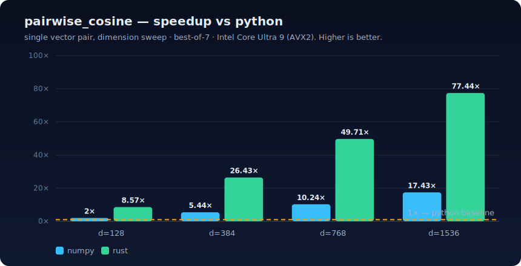
  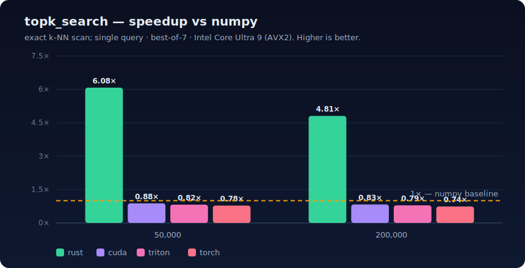
</p>

Full methodology and raw tables: [Performance](docs/PERFORMANCE.md).

## GPU engine

On the **RTX 5090 (Blackwell `sm_120`)**, batched cosine runs **2.4–7.4× faster
than the multi-core Rust CPU path** across the CUDA, Triton, and PyTorch backends
(compute-bound). A single-query top-k is *transfer-bound* — it ships the whole
corpus across PCIe for too little work — so it stays on the CPU until the corpus
is resident on-device. Arithmetic intensity decides the winner:

<p align="center">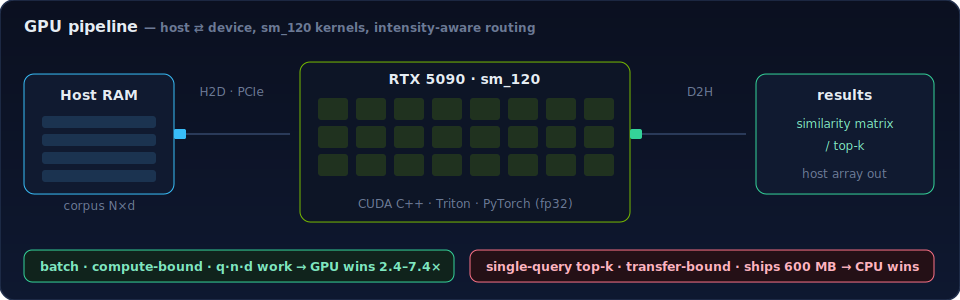</p>

The hand-written CUDA kernels compile **natively for `sm_120`** via CuPy's NVRTC
12.9 — no system-CUDA upgrade required. See
[§4 of the performance doc](docs/PERFORMANCE.md#4-gpu-acceleration--cuda--triton--pytorch).

## Installation

**Prerequisites:** Rust (stable, MSVC on Windows) via [rustup](https://rustup.rs),
Python 3.9+, a C/C++ toolchain.

```bash
git clone https://github.com/0DevDutt0/neuralforge-x
cd neuralforge-x

python -m venv venv && . venv/Scripts/activate   # Windows; use venv/bin/activate on Linux/macOS
pip install -e ".[dev]"                            # builds the Rust extension via maturin
```

> **Windows note:** if the prebuilt `maturin.exe` is blocked by an Application
> Control policy, build locally with `pwsh scripts/dev_build.ps1` (cargo build +
> place the `.pyd`). See the [Developer Guide](docs/DEVELOPER_GUIDE.md).

## Quickstart

```python
import numpy as np
import neuralforge as nf
from neuralforge import VectorIndex, Filter

# --- stateless kernels -------------------------------------------------
a = np.random.rand(768).astype(np.float32)
corpus = np.random.rand(100_000, 768).astype(np.float32)
nf.cosine_similarity(a, corpus[0])                    # -> float
res = nf.top_k_search(a, corpus, k=5, metric="cosine")
res.indices, res.scores                               # int64[5], float32[5]

# --- HNSW vector database with metadata filtering ----------------------
idx = VectorIndex(dim=768, metric="cosine")
idx.add(1, a, {"lang": "rust", "year": 2026})
hits = idx.search(a, k=5, filter=Filter.eq("lang", "rust") & Filter.ge("year", 2024))
idx.save("snapshot.parquet")                          # DuckDB-queryable
```

Run the bundled examples:

```bash
python examples/01_quickstart.py
python examples/02_numpy_vs_rust_benchmark.py
python examples/03_vector_db.py            # HNSW + DuckDB-over-Parquet (agrees 5/5)
```

## Benchmarks

- **Rust micro-benchmarks** (criterion): `cargo bench -p neuralforge_core`
  — scalar vs AVX2 across dims {128, 384, 768, 1536} and corpus scaling.
- **Cross-stack lab** (Python): `python -m benchmark_lab all` — Python · NumPy ·
  Rust · GPU · HNSW on one workload set; captures latency/throughput/memory/CPU%/
  GPU%, verifies against a NumPy oracle, and regenerates `docs/assets/bench_*.svg`
  plus a Markdown report. `--quick` runs a fast CPU-only smoke. See
  [benchmark_lab/](benchmark_lab/).

## Profiling

The [`profiling/`](profiling/) lab pairs a portable **analysis** path with
external-tool **capture**. `python profiling/analyze.py` turns criterion medians
into [`CPU_PROFILE.md`](profiling/CPU_PROFILE.md) and the chart below — the
AVX2+FMA `dot_product` kernel saturates **~33 Gelem/s** and is *load-bound* past
384-dim, which is exactly why scale-out uses `rayon` rather than a wider kernel.
`scripts/cpu_flamegraph.ps1` (cargo flamegraph) and `scripts/gpu_nsight.ps1`
(Nsight) capture call-stacks/timelines against sustained-load targets.

<p align="center">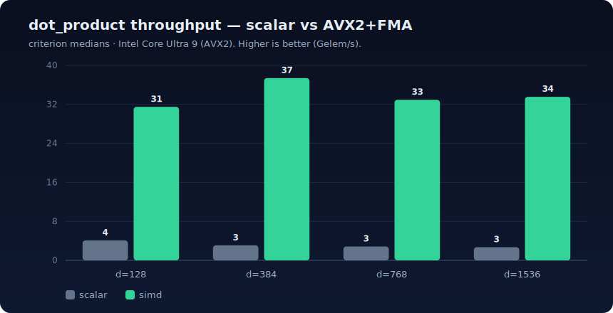</p>

## Observability

[`neuralforge_service`](observability/) is an **axum** HTTP service exposing the
HNSW engine in-process (`/v1/search`, `/v1/vectors`, `/v1/stats`) with production
telemetry: a Prometheus `/metrics` endpoint, structured `tracing` logs with
optional **OpenTelemetry** OTLP export, and `/healthz` · `/readyz` probes with
graceful shutdown.

<p align="center"></p>

```bash
cd observability && docker compose up --build
# service :8080 · Prometheus :9090 · Grafana :3000 · Jaeger :16686
```

## Scaling

Row-major contiguous corpora keep vectors cache-resident; rayon scales batch and
top-k across all physical cores; retrieval memory stays `O(k·threads)`. Past the
exact-scan budget, the **HNSW** index gives sub-linear ANN search with Parquet
persistence, and compute-bound batches offload to the GPU. See
[Capacity Planning](docs/CAPACITY_PLANNING.md).

## Documentation

Browse the full set as a **MkDocs Material** site — `pip install -e ".[docs]"`
then `python -m mkdocs serve` (deployed to GitHub Pages by CI).

| Doc | What |
|-----|------|
| [Architecture](docs/ARCHITECTURE.md) | Hexagonal design, module boundaries, decisions |
| [System Design](docs/SYSTEM_DESIGN.md) | End-to-end runtime flow & subsystems |
| [API Reference](docs/API_REFERENCE.md) | Python SDK, `VectorIndex`, GPU, HTTP service |
| [Developer Guide](docs/DEVELOPER_GUIDE.md) | Build, test, troubleshoot |
| [Performance](docs/PERFORMANCE.md) | Methodology, real numbers, analysis |
| [Capacity Planning](docs/CAPACITY_PLANNING.md) | Scaling & sizing |
| [SECURITY.md](docs/SECURITY.md) · [CONTRIBUTING.md](CONTRIBUTING.md) · [ROADMAP.md](ROADMAP.md) | Policy & process |

## Roadmap

All nine vertical slices are complete — see [ROADMAP.md](ROADMAP.md) for the
per-phase write-ups.

| 0 · Foundation | 1 · `rust_core` | 2 · `python_sdk` | 3 · `cuda_engine` | 4 · `vector_db` |
|:--:|:--:|:--:|:--:|:--:|
| ✅ | ✅ | ✅ | ✅ | ✅ |
| **5 · `benchmark_lab`** | **6 · `profiling`** | **7 · `observability`** | **8 · `docs`** | **9 · README** |
| ✅ | ✅ | ✅ | ✅ | ✅ |

## Contributing

Contributions welcome — see [CONTRIBUTING.md](CONTRIBUTING.md). Every change must
clear the same gate CI enforces: tests, `clippy -D warnings`, `rustfmt`, `ruff`,
`mypy`, and a benchmark for performance-sensitive code.

## Engineering competencies demonstrated

> A map for reviewers and recruiters: each module is a concrete demonstration of
> a distinct infrastructure-engineering skill.

| Module / artifact | Competency |
|-------------------|------------|
| `rust_core` (SIMD + rayon) | **Systems programming** — `unsafe` SIMD, ILP, data parallelism, cache-aware layout |
| `python_sdk` (PyO3/maturin) | **Python internals** — extension modules, GIL management, zero-copy FFI, abi3 packaging |
| `cuda_engine` (CUDA) | **GPU engineering** — Blackwell `sm_120` kernels, occupancy, memory hierarchy |
| `cuda_engine` (Triton) | **Kernel optimization** — tiling, autotuning, fused ops |
| `vector_db` (HNSW) | **Retrieval infrastructure** — ANN graphs, metadata filtering, recall evaluation |
| Parquet / DuckDB | **Data systems** — columnar storage, self-describing snapshots, query interop |
| `benchmark_lab` / `profiling` | **Performance engineering** — cross-stack measurement, roofline analysis |
| `neuralforge_service` (axum) | **Backend & API design** — async HTTP, typed errors, graceful shutdown |
| OpenTelemetry / Prometheus / Grafana | **Observability & monitoring** — tracing, metrics, dashboards, health/readiness |
| GitHub Actions · Docker · MkDocs | **Production delivery** — CI gates, reproducible builds, docs as code |
| `proptest` / `criterion` / `hypothesis` | **Correctness engineering** — property testing, benchmarking, parity oracles |

## License

Dual-licensed under either of [MIT](LICENSE-MIT) or [Apache-2.0](LICENSE-APACHE)
at your option.

<p align="center"><sub>Built by <a href="https://github.com/0DevDutt0">Devdutt S</a> — Kochi, India.</sub></p>
