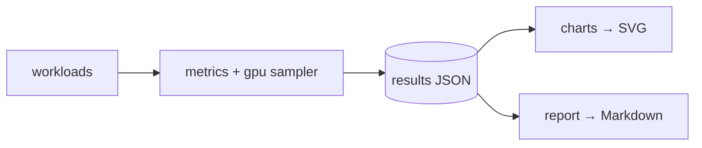

# benchmark_lab — cross-stack benchmarking (Phase 5)

A unified harness that measures the **same** workloads across every compute
backend in the project — pure **Python**, **NumPy**, the **Rust** core, and the
**GPU** engine (CUDA / Triton / PyTorch) — and renders the results as committed
SVG charts and Markdown summaries.

## What it measures

| Metric | Source |
|--------|--------|
| latency (best / median / p90 / stdev) | `time.perf_counter`, best-of-N |
| throughput | work items ÷ best time |
| host memory (peak transient) | `tracemalloc` (+ RSS via `psutil`) |
| CPU% | `psutil` (can exceed 100% on the rayon paths) |
| GPU% + GPU memory | NVML (`nvidia-ml-py`), sampled during the kernel |

Every accelerated backend is verified against the NumPy oracle before its
timings are trusted; the HNSW backend additionally reports **recall@k**.

## Workloads

| Workload | Backends | Story |
|----------|----------|-------|
| `pairwise_cosine` | Python · NumPy · Rust | scalar → SIMD ladder over a dim sweep |
| `batch_cosine` | NumPy · Rust · CUDA · Triton · PyTorch | throughput headline |
| `topk_search` | NumPy · Rust · CUDA · Triton · PyTorch · **HNSW** | exact scan vs ANN (latency + recall) |

## Usage

```bash
python -m benchmark_lab run            # measure → results/cross_stack.json
python -m benchmark_lab charts         # results JSON → docs/assets/*.svg
python -m benchmark_lab report         # results JSON → Markdown summary (stdout)
python -m benchmark_lab all            # run, then charts, then report
python -m benchmark_lab run --quick    # tiny CPU-only config (used by tests)
```

Optional metric sources: `pip install -e .[bench]` (psutil + NVML). Without them
the harness still runs and simply omits CPU%/GPU% columns.

## Outputs

- `results/*.json` — machine-readable runs (git-ignored; reproduce locally).
- `docs/assets/bench_*.svg` — committed charts referenced by the README/docs,
  regenerated from a results file by `python -m benchmark_lab charts`.

See [PERFORMANCE.md](../docs/PERFORMANCE.md) for current numbers and methodology.

