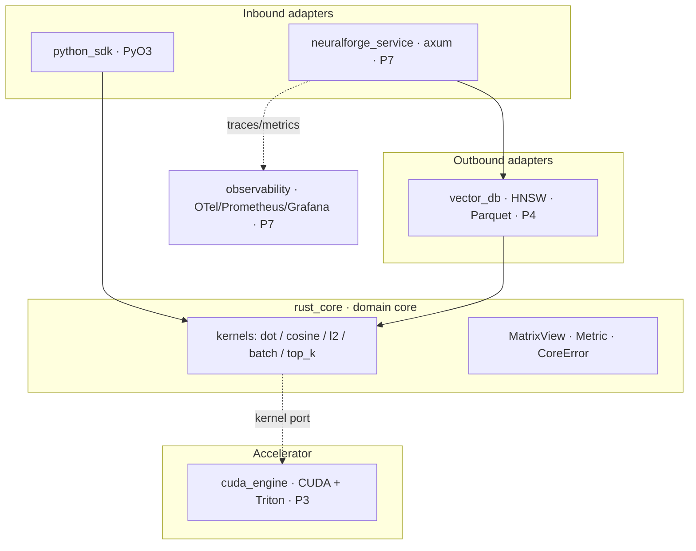

# Architecture

NeuralForge-X is organised as a **hexagonal (ports-and-adapters)** system. A
small, dependency-light *domain core* holds the compute; everything else —
language bindings, the HTTP service, the GPU accelerator, persistence,
observability — is an adapter at the edge that depends *inward* on the core. The
core depends on nothing but the standard library and `rayon`.

(Rendered diagram: [`assets/architecture.svg`](assets/architecture.svg).)

## Why hexagonal here

The same compute is reachable from many surfaces — embedded in a Python process,
behind an HTTP endpoint, or offloaded to a GPU. Keeping the kernels free of I/O
and framework concerns means each surface is a thin adapter, the core is
trivially fast to test, and an accelerator can implement the *same kernel contract* without
the callers changing. This is SOLID in practice: the dependency-inversion arrow
points from adapters to the core, never the reverse.

## Module map

| Crate / package | Layer | Responsibility | Status |
|-----------------|-------|----------------|--------|
| `rust_core` | domain | SIMD + parallel kernels, types, errors | ✅ |
| `python_sdk` | inbound adapter | PyO3 bindings + typed Python API (kernels + `VectorIndex`) | ✅ |
| `cuda_engine` | accelerator | CUDA C++ & Triton kernels (+ PyTorch baseline) | ✅ |
| `vector_db` | outbound adapter | hand-written HNSW index + Parquet persistence (DuckDB-queryable) | ✅ |
| `benchmark_lab` | tooling | cross-stack harness, generated SVG charts, reports | ✅ |
| `profiling` | tooling | criterion analysis + flamegraph/Nsight capture | ✅ |
| `observability` | inbound adapter | axum service (`neuralforge_service`) + OTel/Prometheus/Grafana | ✅ |

## Core design decisions

### 1. Data layout — contiguous row-major `f32`
Corpora are a single `Vec<f32>` of `n × d` in row-major order, wrapped by a
borrow-only [`MatrixView`](https://github.com/0DevDutt0/neuralforge-x/blob/main/rust_core/src/matrix.rs). Not `Vec<Vec<f32>>`: a
flat buffer keeps each vector on contiguous cache lines, enables wide vector
loads, and — crucially — is **bit-compatible with a C-contiguous NumPy array**,
so the Python boundary is genuinely zero-copy.

### 2. SIMD with runtime dispatch
The hot primitives (`dot`, `l2_sq`) have a scalar reference and a hand-vectorised
AVX2 + FMA implementation. Selection happens at runtime via
`is_x86_feature_detected!`, so one binary runs everywhere and simply uses the
best available path; non-x86 targets fall back to scalar. `unsafe` is confined to
the vectorised functions and justified by that runtime guard (see
[SECURITY.md](SECURITY.md)). Four independent accumulators expose ILP.

### 3. Parallelism — rayon, with the right granularity
`batch_similarity` parallelises across queries (`par_chunks_mut` over disjoint
output rows — no locking). `top_k_search` uses a **fold/reduce of per-thread,
size-`k` bounded min-heaps**: each worker keeps only its best `k`, then heaps are
merged. This is `O(n·d + n·log k)` time and `O(k · threads)` memory — it never
allocates the full `n`-length score array.

### 4. Ranking normalisation
Top-k ranks on a single "higher is better" key. Cosine/dot use the value
directly; L2 uses the *negated* squared distance (monotonic, avoids a per-element
`sqrt`), with the true distance recovered only for the final `k` results. Ties
break on index for deterministic output.

### 5. Error model & the FFI boundary
The core returns typed [`CoreError`](https://github.com/0DevDutt0/neuralforge-x/blob/main/rust_core/src/error.rs) (`thiserror`) rather
than panicking. The PyO3 layer maps these to Python `ValueError`, and the Python
wrapper adds a richer hierarchy (`NeuralForgeError` → `InvalidInputError`,
`DimensionMismatchError`, `InvalidMetricError`) that subclasses `ValueError` for
ergonomic handling. Panics never cross the FFI boundary.

### 6. GIL strategy
Bindings borrow NumPy buffers read-only (`PyReadonlyArray`) and wrap the Rust
compute in `Python::allow_threads`, releasing the GIL so other Python threads run
during the parallel work. Inputs are coerced to contiguous `float32` in Python
before crossing the boundary.

### 7. Packaging
A Cargo workspace builds the `rlib` core and the `cdylib` extension; **maturin**
merges the compiled `neuralforge._native` with the pure-Python `neuralforge`
package into one abi3 wheel (Python 3.9+), so a single artifact serves many
interpreter versions.

### 8. Retrieval — hand-written HNSW with soft deletes
`vector_db` implements a Hierarchical Navigable Small-World graph from scratch
(seeded level assignment, neighbour-selection heuristic, filtered beam search)
that reuses the core's SIMD distance kernels — so the approximate index and the
exact brute force rank by **one** numeric implementation, which is what makes
recall measurable. The graph is append-only; deletes/updates tombstone and
`compact()` rebuilds. Snapshots are columnar **Parquet** (pure-Rust
`arrow`/`parquet`), engine-agnostic so DuckDB can query them directly.

### 9. Service — in-process engine, observable by construction
`neuralforge_service` (axum/tokio) serves the HNSW store **in-process** (no FFI,
no second runtime). Telemetry is first-class: a Prometheus `/metrics` endpoint,
`tracing` spans with optional OpenTelemetry OTLP export, and `/healthz`/`/readyz`
probes — the cross-cutting concerns live in middleware, not the handlers.

## Key tradeoffs

| Decision | Chosen | Alternative | Rationale |
|----------|--------|-------------|-----------|
| SIMD | `std::arch` AVX2 + runtime dispatch | `portable_simd` (nightly) | Stable toolchain; one portable binary |
| Width | AVX2 (8-wide) | AVX-512 | AVX-512 absent on Core Ultra |
| Top-k | per-thread bounded heaps | full sort / full score array | `O(k·threads)` memory, parallel |
| Layout | flat row-major `f32` | `Vec<Vec<f32>>` | cache locality + zero-copy NumPy |
| Errors | typed `Result` | panics | clean FFI, actionable messages |

## Further reading

[SYSTEM_DESIGN.md](SYSTEM_DESIGN.md) ·
[DEVELOPER_GUIDE.md](DEVELOPER_GUIDE.md) ·
[API_REFERENCE.md](API_REFERENCE.md) ·
[CAPACITY_PLANNING.md](CAPACITY_PLANNING.md) ·
[PERFORMANCE.md](PERFORMANCE.md)
