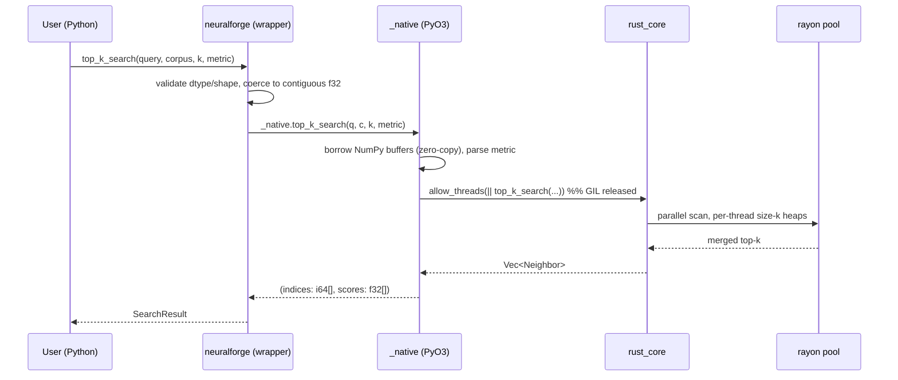
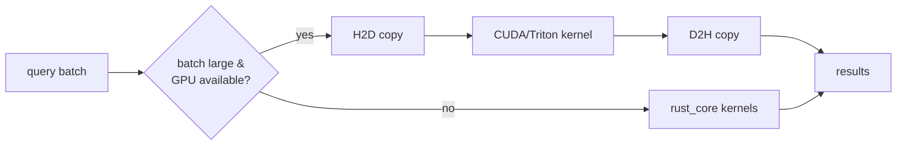
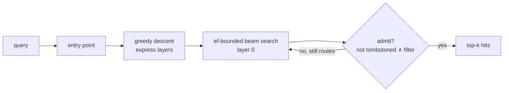

# System Design

This document covers how the pieces fit together at runtime and how the system
evolves across phases. For the layering rationale see [ARCHITECTURE.md](ARCHITECTURE.md).

## Request flow — `top_k_search` today

The GIL is held only for validation and buffer borrowing; the `O(n·d)` work runs
GIL-free, so a multi-threaded Python service can overlap searches.

## Threading model

- **rayon** owns a global work-stealing pool sized to physical cores (override
  with `RAYON_NUM_THREADS`).
- `batch_similarity` partitions the *output* by query row → disjoint mutable
  slices, zero synchronisation.
- `top_k_search` uses fold/reduce: each worker holds a private size-`k` heap;
  only the final merge touches shared state. No locks on the hot path.

## Data model

A corpus is an `(n, d)` row-major `float32` block. The same bytes are shared,
not copied, between NumPy and Rust (`MatrixView` borrows the NumPy buffer).
Identity of a vector is its **row index**; results carry indices so callers can
join back to their own metadata store.

## Subsystems (as built)

### Phase 3 — GPU offload (`cuda_engine`)
The kernel set becomes a *port* with two implementations: CPU (`rust_core`) and
GPU (CUDA/Triton). A capability check (`sm_120` present, VRAM sufficient) selects
the backend; large batched workloads route to the GPU, small/interactive ones
stay on CPU to avoid transfer overhead.

### Phase 4 — Vector DB (`vector_db`)
A hand-written **HNSW** graph provides sub-linear ANN search; the exact kernels
remain available for re-ranking and recall evaluation (the graph reuses them, so
both rank identically). The `VectorStore` repository port exposes
`insert`/`delete`/`update`/`search` over external `u64` ids with a composable
metadata `Filter` applied **during** traversal; deletes tombstone and
`compact()` rebuilds. Persistence is a self-describing **Parquet** snapshot via
the pure-Rust `arrow`/`parquet` stack — the index is replayed from the columnar
store on load, and the file is engine-agnostic so **DuckDB** queries it directly.

### Phases 5–6 — Benchmark & profiling labs
`benchmark_lab` (`python -m benchmark_lab`) measures the same workloads across
Python · NumPy · Rust · GPU · HNSW, verifies the accelerated backends against a
NumPy oracle, and **generates** the committed SVG charts from a results JSON.
`profiling` turns criterion medians into a CPU optimization report + chart, and
ships `cargo flamegraph` / Nsight capture scripts against sustained-load targets.

### Phase 7 — Service & observability (`neuralforge_service`)
An **axum** service exposes the HNSW engine **in-process** over HTTP:
- `POST /v1/search` (`{query, k, ef?, filter?}`), `POST /v1/vectors`,
  `DELETE /v1/vectors/{id}`, `GET /v1/stats`;
- `GET /healthz` (liveness), `GET /readyz` (readiness, 503 while draining);
- `GET /metrics` (Prometheus: `nfx_http_requests_total`,
  `nfx_http_request_duration_seconds`, `nfx_index_vectors`, `nfx_search_results`);
- `tracing` spans per request with optional **OpenTelemetry** OTLP/gRPC export to
  a collector (the `otel` feature);
- a `docker compose` stack — OTel Collector → Jaeger (traces), Prometheus →
  Grafana (metrics + a provisioned dashboard).

## Deployment

Local-first: a single abi3 wheel (SDK) and a static-ish service binary. The
observability stack is one command — `cd observability && docker compose up
--build` — bringing up the service, OTel Collector, Jaeger, Prometheus, and
Grafana. No cloud services, no paid APIs — by design.

## Failure & back-pressure

- Input validation fails fast with typed errors before any compute; the service
  maps them to the right status (`400`/`404`/`409`) with a JSON body.
- Each request is bounded by a timeout layer and wrapped in a catch-panic layer,
  so a single bad request can neither hang nor crash the server.
- On `SIGINT`/`SIGTERM` the service flips `/readyz` to `503` and drains in-flight
  requests before exiting, so a load balancer stops routing first.
- The engine's retrieval working memory is `O(k · threads)` regardless of corpus
  size, so search has no per-request heap blow-up to back-pressure against.
