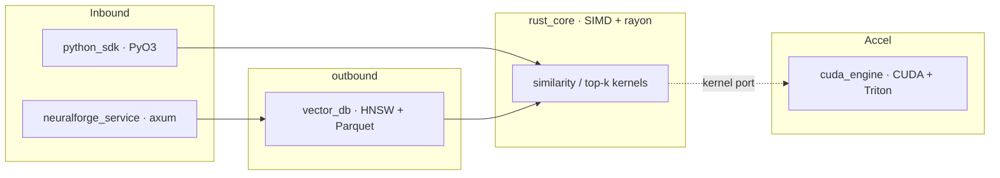

# NeuralForge-X

**High-performance AI infrastructure** — vector search, GPU acceleration,
retrieval, benchmarking, profiling, and an observable service — built in
**Rust + Python**, fully local, no paid APIs.

This is the documentation site. For the project overview, badges, and quickstart
see the [README on GitHub](https://github.com/0DevDutt0/neuralforge-x).

## Start here

| If you want to… | Read |
|-----------------|------|
| Understand the layering & decisions | [Architecture](ARCHITECTURE.md) |
| See how requests flow at runtime | [System Design](SYSTEM_DESIGN.md) |
| Call the library or service | [API Reference](API_REFERENCE.md) |
| Build, test, and contribute | [Developer Guide](DEVELOPER_GUIDE.md) |
| Read the measured numbers | [Performance](PERFORMANCE.md) |
| Size a deployment | [Capacity Planning](CAPACITY_PLANNING.md) |
| Review the security posture | [Security](SECURITY.md) |

## The stack at a glance

| Module | Role |
|--------|------|
| [`rust_core`](https://github.com/0DevDutt0/neuralforge-x/tree/main/rust_core) | SIMD (AVX2+FMA) + rayon similarity & top-k kernels |
| [`python_sdk`](https://github.com/0DevDutt0/neuralforge-x/tree/main/python_sdk) | PyO3/maturin typed Python SDK (kernels + `VectorIndex`) |
| [`cuda_engine`](https://github.com/0DevDutt0/neuralforge-x/tree/main/cuda_engine) | CUDA C++ **and** Triton kernels (+ PyTorch baseline), native `sm_120` |
| [`vector_db`](https://github.com/0DevDutt0/neuralforge-x/tree/main/vector_db) | hand-written HNSW index + Parquet persistence |
| [`benchmark_lab`](https://github.com/0DevDutt0/neuralforge-x/tree/main/benchmark_lab) | cross-stack harness → generated SVG charts |
| [`profiling`](https://github.com/0DevDutt0/neuralforge-x/tree/main/profiling) | criterion analysis + flamegraph/Nsight capture |
| [`observability`](https://github.com/0DevDutt0/neuralforge-x/tree/main/observability) | axum service + OTel/Prometheus/Grafana |
