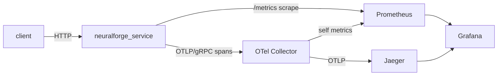

# observability — instrumented service + monitoring stack (Phase 7)

`neuralforge_service` is a small **axum** HTTP service that exposes the
NeuralForge-X vector engine **in-process** (the Phase-4 HNSW store, no FFI) with
the observability a real service needs: Prometheus metrics, structured tracing
with OpenTelemetry export, and health/readiness probes. A `docker compose` stack
wires it to **OpenTelemetry Collector → Jaeger** (traces) and
**Prometheus → Grafana** (metrics + a provisioned dashboard).

## API

| Method & path | Body / params | Purpose |
|---------------|---------------|---------|
| `GET /healthz` | — | liveness (always 200 while running) |
| `GET /readyz` | — | readiness (200 ready, 503 draining) |
| `GET /metrics` | — | Prometheus exposition |
| `GET /v1/stats` | — | `{vectors, dim, metric, tombstones}` |
| `POST /v1/vectors` | `{id, vector, metadata?}` | insert (201; 409 on duplicate) |
| `DELETE /v1/vectors/{id}` | — | soft-delete (204; 404 if absent) |
| `POST /v1/search` | `{query, k, ef?, filter?}` | ranked hits |

`filter` is the `vector_db` predicate language as JSON, e.g.
`{"And": [{"Eq": ["lang", "rust"]}, {"Ge": ["year", 2024]}]}`.

## Run it natively

```bash
cargo run -p neuralforge_service                      # binds 0.0.0.0:8080
# in another shell:
curl localhost:8080/healthz
curl -XPOST localhost:8080/v1/vectors -H 'content-type: application/json' \
     -d '{"id":1,"vector":[1,0,0],"metadata":{"lang":"rust"}}'
curl -XPOST localhost:8080/v1/search -H 'content-type: application/json' \
     -d '{"query":[1,0.05,0],"k":1,"filter":{"Eq":["lang","rust"]}}'
curl localhost:8080/metrics
```

Configuration (env): `NFX_BIND` (`0.0.0.0:8080`), `NFX_DIM` (`768`),
`NFX_METRIC` (`cosine`), `NFX_OTEL_ENDPOINT` (OTLP gRPC, e.g.
`http://otel-collector:4317`), `NFX_SERVICE_NAME`, `RUST_LOG`.

## Run the full stack

```bash
cd observability
docker compose up --build
```

| Service | URL | What |
|---------|-----|------|
| service | http://localhost:8080 | the engine API + `/metrics` |
| Prometheus | http://localhost:9090 | scrapes service + collector |
| Grafana | http://localhost:3000 | dashboard *NeuralForge-X — Service Observability* (anonymous admin) |
| Jaeger | http://localhost:16686 | request traces (service → collector → Jaeger) |



## Telemetry

- **Metrics** (`metrics` + `metrics-exporter-prometheus`): `nfx_http_requests_total`
  (by method/route/status), `nfx_http_request_duration_seconds` (histogram, by
  route), `nfx_index_vectors` (gauge), `nfx_search_results` (histogram). Routes
  are labelled by the *matched* path so cardinality stays bounded.
- **Tracing** (`tracing` + `tracing-subscriber`): JSON logs always on; with the
  `otel` Cargo feature and `NFX_OTEL_ENDPOINT` set, request spans are batch-exported
  over OTLP/gRPC. OTLP init failure is non-fatal — the service degrades to logs +
  metrics rather than refusing to start.
- **Health**: `/healthz` (liveness) and `/readyz` (readiness, flipped to 503 while
  draining on SIGTERM) for Kubernetes-style probes.

## Layout

```
observability/
  src/{main,lib,config,state,telemetry,metrics,error,routes}.rs
  tests/api.rs                      # tower-oneshot integration tests
  Dockerfile                        # multi-stage Rust build (otel feature on)
  docker-compose.yml                # service + collector + Jaeger + Prometheus + Grafana
  otel-collector-config.yaml  prometheus.yml
  grafana/provisioning/{datasources,dashboards}/  grafana/dashboards/neuralforge.json
```
